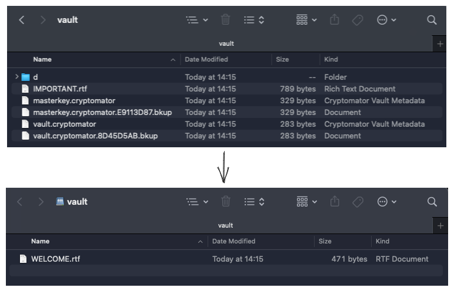

# Cryptomator-webdav

This repo contains a set of docker files to create a docker image to run the [Cryptomator cli](https://github.com/cryptomator/cli) within Docker.
The Cryptomator-cli application shares a local Cryptmator vault over an TLS protected webdav share.

:warning: The webdav server contained within the Cryptomator-cli application provides **no username or password** access controls. Take your own appropriate security precautions.

:warning: As of June 2023, Cryptomator states the cli application is still in an early stage and not ready for production use. We recommend using it only for testing and evaluation purposes.



## Usage Instructions

Set your cryptomator vault password, either by setting the CRYPTOMATOR_VAULT_PASS variable in `.env`, or writing it to a file named `vault.pass` in the root of the repo.

```shell
# Copy the `sample.env` file to `.env`
cp sample.env .env
# Update `.env` file with your local settings
# Either set CRYPTOMATOR_VAULT_PASS in .env or write password to a file named 'vault.pass'
# Run the image using docker-compose
docker-compose up cryptomator-webdav
# The vault will be accessible on the docker host machine on the port specified in the .env file
```

By default the cryptomator vault will be available over webdav at the following url, using a self-signed certificate, with no username or password on the webdav share.

```bash
webdavs://127.0.0.1:18081/vault
```

If you wish to be able to access the vault over the the docker host's external IPs, update CRYPTOMATOR_HOST in `.env` to either 0.0.0.0 (all ips), or a specific docker host IP.

### File Permissions

This docker image is setup to drop privileges to a userID and groupID specified in the Environment Variables. This is to aid running under appliance style OS's such as Unraid, where all containers are run as root by default. Dropping privileges within the container ensures Cryptomator only has access to the userID and groupID specified in the CRYPTOMATOR_UID and CRYPTOMATOR_GID environment variables.

**Ensure that your local Cryptomator vault files are read and writable by the userID  selected.**

#### Permissions Update

Run the following commands across your local cryptomator vault files to update them for the the default User and Group IDs.

```console
# Change all files to be owned by userID/groupID 1000
chown -R 1000:1000 /path/to/cryptomator/vault

# Change all vault files are only readable and writable by the user
chmod -R u+rwX,g-rwx,o-rwx /path/to/cryptomator/vault
```

### Environment variables explanation

```bash
# .env file
# CRYPTOMATOR_VAULT_SRC_PATH: The location of the local, encrypted Cryptomator files
CRYPTOMATOR_VAULT_SRC_PATH='/location/of/local/cryptomator/vaule/files'

# CRYPTOMATOR_VAULT_PASS: The cryptomator password to unencrypt the vault
CRYPTOMATOR_VAULT_PASS='password'
# Or CRYPTOMATOR_VAULT_PASSFILE: The path to a local password file
CRYPTOMATOR_VAULT_PASSFILE='./vault.pass'
# Note: CRYPTOMATOR_VAULT_PASSFILE takes precidence

# CRYPTOMATOR_HOST: The ip the container should attach to, 127.0.0.1 by default
# Set to 0.0.0.0 if you are happy having the webdav share accessible to the docker host's external IPs
CRYPTOMATOR_HOST='127.0.0.1'

# CRYPTOMATOR_PORT: The port the webdav share will be shared on outside the container, used in docker-compose when running the container
CRYPTOMATOR_PORT=18081

# CRYPTOMATOR_UID: The user ID cryptomator should run as
CRYPTOMATOR_UID=1000

# CRYPTOMATOR_GID: The group ID cryptomator should run as
CRYPTOMATOR_GID=1000

# CRYPTOMATOR_UMASK: The umask to create new file as, the default only allows access by owner
CRYPTOMATOR_UMASK=0077
```

### Using a signed cert

If you have a trusted certificate you with to use for the TLS layer, you can bind mount it over the top of the self signed cert within the image.

Add the following line under the Volumes entry within the docker-compose.yml file:

```yml
   # Volumes:
      - /path/to/local/signed/cert.pem::/etc/stunnel/stunnel.pem:ro
```

This will force the internal stunnel TLS wrapper to use your own signed cert in place of it's own self-signed one.

## Docker Image Rebuild Intructions

```shell
# Clone the repo
git clone git@github.com:greycubesgav/cryptomator-webdav.git
cd cryptomator-webdav
# Copy the `sample.env` file to `.env`
cp sample.env .env
# Build the docker image using docker-compose
docker-compose build cryptomator-webdav
# Image will be built as greycubesgav/cryptomator-webdav
```

## Upgrade version of internal cryptomator-cli instructions

To upgrade to a newer version of cryptomator-cli within the docker image:

* Download and unzip the new release package from the [cryptomator-cli releases page](https://github.com/cryptomator/cli/releases)
* Rebuild the docker image

```bash
wget -P packages 'https://github.com/cryptomator/cli/releases/download/0.6.2/cryptomator-cli-0.6.2-linux-x64.zip'
ln -s -f cryptomator-cli-0.6.2-linux-x64.zip packages/cryptomator-cli-latest-linux-x64.zip
make build-cryptomator-webdav
```

## Debugging

### To check what environment variables are getting set in the container

```bash
make run-dev-env
```

### To run the docker container using an environment variable password, connect to a local shell and manually run the entrypoint script

```bash
make run-dev-build
/entrypoint.sh
```

### To run the docker container using an password file, connect to a local shell and manually run the entrypoint script

```bash
make run-dev-build-passfile
/entrypoint.sh
```
